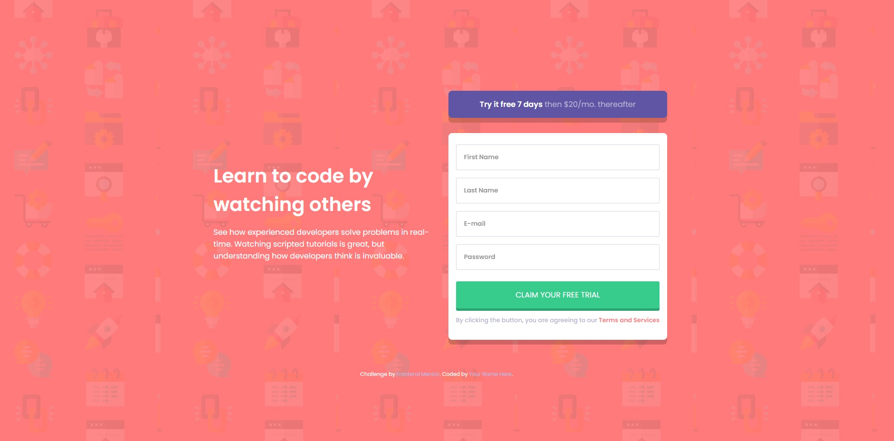

# Frontend Mentor - Intro component with sign up form solution

This is a solution to the [Intro component with sign up form challenge on Frontend Mentor](https://www.frontendmentor.io/challenges/intro-component-with-signup-form-5cf91bd49edda32581d28fd1). Frontend Mentor challenges help you improve your coding skills by building realistic projects. 

## Table of contents

- [Overview](#overview)
  - [The challenge](#the-challenge)
  - [Screenshot](#screenshot)
  - [Links](#links)
- [My process](#my-process)
  - [Built with](#built-with)
  - [What I learned](#what-i-learned)
  - [Continued development](#continued-development)
- [Author](#author)

## Overview

### The challenge

Users should be able to:

- View the optimal layout for the site depending on their device's screen size
- See hover states for all interactive elements on the page
- Receive an error message when the `form` is submitted if:
  - Any `input` field is empty. The message for this error should say *"[Field Name] cannot be empty"*
  - The email address is not formatted correctly (i.e. a correct email address should have this structure: `name@host.tld`). The message for this error should say *"Looks like this is not an email"*

### Screenshot

### Links

- Solution URL: [Click here](https://github.com/simplyJC/intro-component-with-signup-form-master)
- Live Site URL: [Click here](https://objective-edison-d5f2b5.netlify.app/)
- 2nd Version base on [WEB CIFAR](https://www.youtube.com/watch?v=HD4qiSU1CBQ&list=LL&index=2&t=2204s), Live Site URL:  [Click Here](https://distracted-hopper-0d1dab.netlify.app/)
- 2nd Solution URL: [Click Here](https://github.com/simplyJC/intro-component-with-signup-form-master/tree/other-js-code)

## My Process
### Built with

- Semantic HTML5 markup
- BEM
- Flexbox
- CSS Grid
- Mobile-first workflow

### What I learned

This is my first javascript challenge in frontendmentor. It is quite challenging. I need to learn more about javascript. Although I did learn javascript in the past by video tutorials but doing your own thing is different from following along. You need to be resourceful and look for the answers all over the internet just utilize google search.
### Continued development 

I am planning to build more javascript projects to enhance my learning. 

## Author

- Frontend Mentor - [@simplyJC](https://www.frontendmentor.io/profile/simplyJC)
- Twitter - [@jcaltamia](https://twitter.com/jcaltamia)

